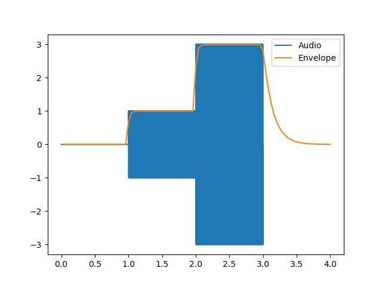

# DSP-for-Audio-Modifier-Fuse
Signal processing functions for a Fuse.

Takes in audio samples, and calculates an envelope of the audio level.

## Usage

First create (or reset) a buffer by calling:
```lua


buffer = initialize_buffer(audio_samples, audio_sample_rate, attack, release)
```

Then you can calculate the envelope at some specified time t:

```lua

env = calculate_raw_envelope(t, lookahead, scale, offset, minval, buffer)

```

### Argument list

#### initialize_buffer()
- audio_samples is a table containing the samples of the audio file.
- audio_sample_rate is a float/integer representing the sample rate of the audio (44100, 48000 etc.)
- attack is a number (in milliseconds) describing how fast the calculated envelope should respond to rising audio levels (1ms is fast. 20-50ms is slower, but good to avoid flickering envelope)
- release is a number (in milliseconds describing how fast the calculated envelope falls when audio level drops. ( Typical would be 200ms perhaps... Again, high values gives a nice, smooth envelope )
The buffer needs to be reset when changing any of the parameters in the initialize_buffer() argument list.

#### calculate_raw_envelope()
- t is the time when you want to calculate the envelope (in seconds). 0 is start of the audio. i'th frame has t = i/frame_rate.
- lookahead is a number (in milliseconds), which lets the code respond to the audio ahead of time. Good to compensate for delay introduced by slow attack. Should be around half of attack value when used for this purpose.
- scale is a number. Final envelope is scaled by this number.
- offset is a number that is added to the final result.
- minval represents a minimum value of the envelope (before scaling and offsetting). I.e. y=max(x-minval,0). This can be used to avoid low audio levels having an effect.
- buffer is the buffer created by the initialize_buffer() function. When the envelope is calculated for a given time, t, the envelope for all times <= t is also calculated and stored in the buffer. Giving faster retrieval the second time one calls calculate_raw_envelope().


## Example
Example plot of envelope calculated from audio.
Simple example with scale=1,offet=0,minval=0, attack=50ms, lookahead=25ms, release=300ms.

